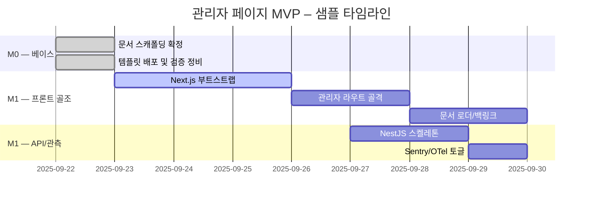

```mermaid
gantt
  title 관리자 페이지 MVP – 샘플 타임라인
  dateFormat  YYYY-MM-DD
  section M0 — 베이스
    문서 스캐폴딩 확정          :done,    m00, 2025-09-22, 1d
    템플릿 배포 및 검증 정비      :done,    m01, 2025-09-22, 1d
  section M1 — 프론트 골조
    Next.js 부트스트랩           :active,  m10, 2025-09-23, 3d
    관리자 라우트 골격           :         m11, after m10, 2d
    문서 로더/백링크             :         m12, after m11, 2d
  section M1 — API/관측
    NestJS 스켈레톤              :         m15, 2025-09-27, 2d
    Sentry/OTel 토글             :         m16, after m15, 1d
```
