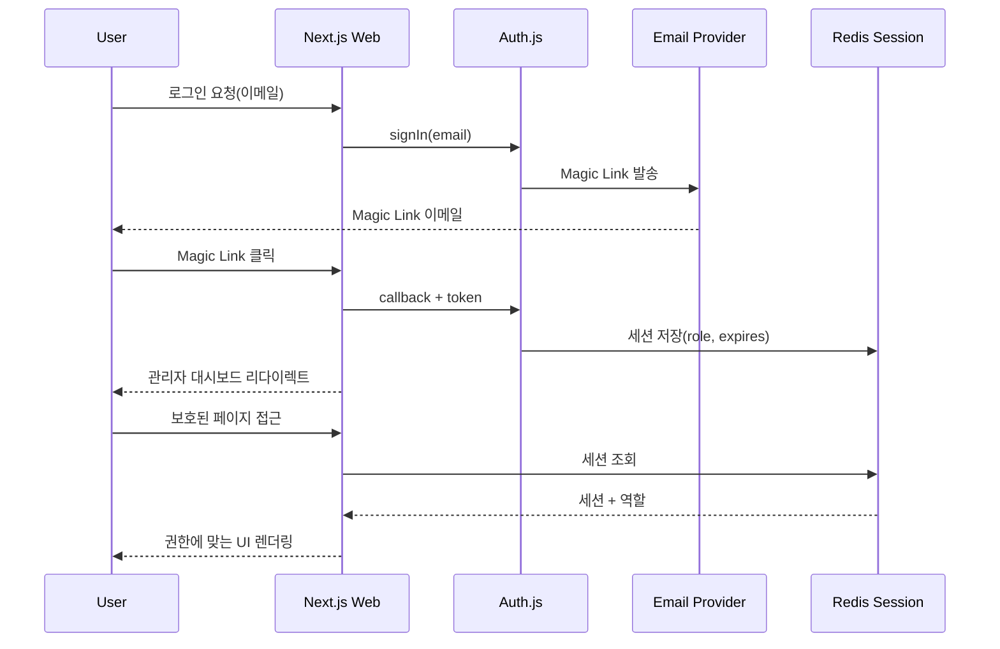

## 목표

- Auth.js를 사용해 이메일 Magic Link를 기본 인증 수단으로 도입한다.
- Redis 기반 세션과 레이트리밋을 적용하여 관리자 접근을 보호한다.
- 역할(RBAC) 체계를 정의하고 API/UI 전반에 미들웨어로 적용한다.

## 아키텍처 개요

1. **Auth.js + 이메일 Magic Link**
   - 공급자: 이메일(Magic Link) → 이후 SMS/소셜 확장 가능.
   - 세션 저장소: Redis (Upstash/Managed/Local Redis).
   - 환경 변수: `AUTH_SECRET`, `AUTH_EMAIL_SERVER`, `AUTH_EMAIL_FROM`.
2. **세션/레이트리밋 레이어**
   - `packages/session` 모듈에서 Redis 클라이언트를 생성.
   - 로그인, 비밀번호 재설정, API 요청 레이트리밋을 동일 모듈에서 관리.
3. **역할 정의**
   - `admin/config/status.yaml` 참고 → 역할 enum 추가 (예: `viewer`, `editor`, `admin`).
   - 기본 정책: `viewer`는 읽기만, `editor`는 문서 편집 가능, `admin`은 시스템 설정.
4. **미들웨어 적용**
   - Next.js: `middleware.ts`에 세션 검증 + 역할 확인.
   - NestJS: custom decorator + guard (`@Roles('admin')`).

## 구현 단계

1. **인프라 준비**
   - `packages/session` 모듈 생성: Redis 커넥션, 세션 직렬화/역직렬화, 레이트리밋 util.
   - `pnpm install auth.js redis` (또는 upstash/redis SDK).
2. **Auth.js 설정 (Next.js)**
   - `apps/web/src/app/api/auth/[...nextauth]/route.ts` 작성.
   - 이메일 송신(개발: console, 운영: SMTP/Resend) 설정.
   - 세션 객체에 역할 필드 포함.
3. **RBAC 미들웨어**
   - Next.js 서버 컴포넌트 & 라우트: `withAuth` HOC, `useSessionRole` 훅.
   - NestJS guard: `RolesGuard` + `@Roles()` decorator.
4. **관리자 UI 반영**
   - 로그인 페이지/오류 처리.
   - 편집 UI 버튼은 `editor` 이상만 노출.
5. **감사 로그 & 모니터링**
   - 로그인/역할 변경 이벤트를 `admin/data/audit.log.json`(초기) 또는 Redis stream에 기록.

### 세부 작업 체크리스트

- [x] `packages/session`에 Redis 연결 및 `getSession`, `setSession`, `clearSession` 함수 작성.
- [x] `apps/web/src/app/api/auth/[...nextauth]/route.ts` 생성 및 이메일 Magic Link provider 설정.
- [x] `apps/web/src/middleware.ts`에서 보호된 경로(`/admin/**`)에 세션 검사 추가.
- [x] `apps/api/src/common/guards/roles.guard.ts`와 `roles.decorator.ts` 작성.
- [x] 역할/권한 매핑을 위한 `admin/config/roles.yaml` 초안 작성.
- [x] `admin/runbooks/auth.md` 작성하여 운영자 credential 발급/회수 절차 정리.

### 인증 흐름 다이어그램

## 디자인 자료

- Figma 보드: https://www.figma.com/design/LEVwW25Z2pNWLacMF3s1iG/gg-real?node-id=0-1&t=ci1hFjAuFeiqHsXr-1 (관리자 인증/그래프 통합 와이어프레임)
- Excalidraw 스케치: https://excalidraw.com/#json=KNXbmAqFeeAqap1mdu7Xn,ap_EtuHMtytHD7j4Y-FBsQ

## TODO

- [ ] 이메일 템플릿 및 SMTP 환경 변수 정의.
- [ ] 세션 만료 정책(Days) 결정.
- [ ] 다중 역할(복합 권한) 여부 결정.
- [ ] 관리자 UI에서 역할에 따른 메뉴/액션 노출 제어.
- [ ] CI에서 인증 관련 e2e 시나리오 정의.
- [x] Figma 또는 Excalidraw에 인증 플로우 다이어그램을 정식으로 추가.
