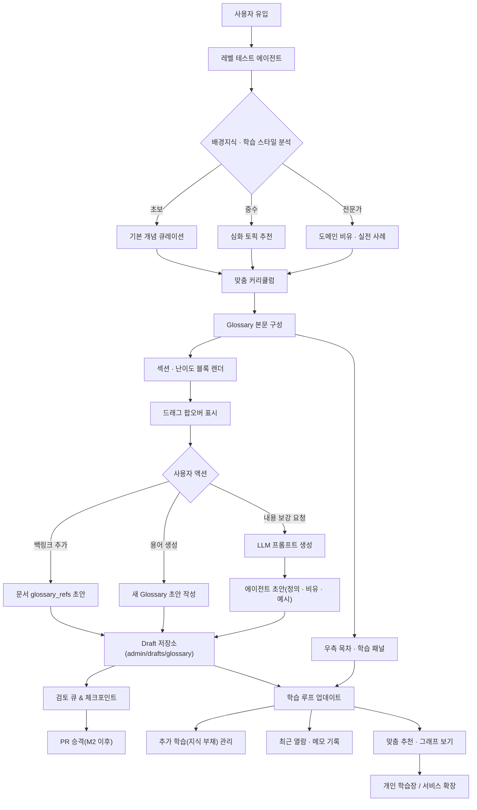
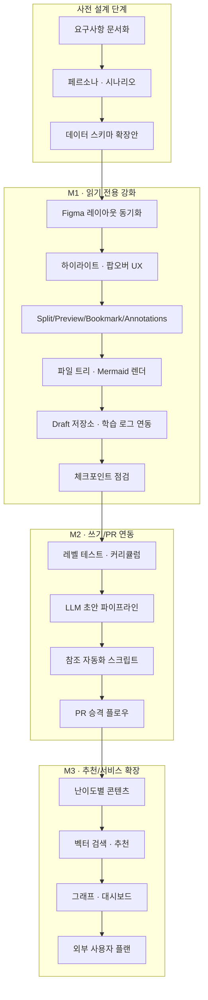

# 개요

- Glossary 화면을 "읽기-탐색-학습" 루프로 확장해 초보자도 스스로 교과서를 구축할 수 있도록 한다.
- 문서-코드 상호 참조, 체크포인트, PR 중심 거버넌스와 충돌하지 않는 단계별 확장(읽기 전용 → PR → 자동화)을 따른다.
- UI는 Figma 시안(ADMIN WIKI | Glossary Layout)을 기준으로 MCP Docs https://platform.openai.com/docs/mcp#page-top 스타일을 벤치마킹한다.

# 목표

- 학습자는 용어를 읽으며 모르는 표현을 즉시 Glossary로 확장하고, 추가 학습/메모/백로그를 한 화면에서 관리한다.
- 에이전트(GPT-5)를 호출해 정의·비유·예시 초안을 안전하게 생성하고, 운영자는 PR 승인을 통해 본문에 반영한다.
- 관련 문서/코드, 백링크, 그래프, 검색이 모두 연결되어 프로젝트 전반 문서 품질을 유지한다.

## 전체 학습 플로우(Logic)



# 단계별 실행(M1~M3)

1. **사전 설계(Prerequisite)**
   - 산출물: 학습 페르소나, 레벨 테스트 질문은행, Glossary/학습 로그 확장 스키마 초안, 체크포인트 정책.
   - 선행조건: Figma 레이아웃/컴포넌트 명세 작성, 위 다이어그램 최신화.
2. **M1 (읽기 전용 강화)**
   - 선행조건: 사전 설계 완료, Draft 저장소 경로 확보.
   - 핵심 태스크:
     - 좌측 트리·본문·우측 패널 UI 정비, 섹션 하이라이트/팝오버/최근 열람 패널 구현.
     - `admin/drafts/glossary/` 저장 구조와 learning-log 동기화 파이프라인 구축.
     - 접근성(키보드·스크린리더) 검토 및 체크포인트 작성.
   - 산출물: 개선된 Glossary 뷰, draft JSON, 체크포인트 리포트, QA 로그.
3. **M2 (쓰기/PR 연동)**
   - 선행조건: M1 배포 및 안정화, draft 저장 구조 사용 검증.
   - 핵심 태스크:
     - 레벨 테스트 액션과 맞춤 커리큘럼 생성 로직 구현(서버 액션).
     - LLM 초안 파이프라인 + `admin/state/augment-queue.json` 작성 및 guardrail 규칙 수립.
     - 문서/코드 참조 자동 업데이트 스크립트, PR 생성 자동화, CI 검증 시나리오 작성.
   - 산출물: 초안 → 검토 큐 → PR → merge 흐름, 자동화 스크립트, 테스트 보고서.
4. **M3 (추천/그래프 고도화)**
   - 선행조건: M2 플로우가 운영 환경에서 안정적으로 동작.
   - 핵심 태스크:
     - glossary 필드 확장(`requires`, `see_also`, `aliases`, `difficulty`, `status`) 및 난이도별 블록 렌더링.
     - 벡터 검색·유사도 추천, React Flow 지식 그래프, 학습 대시보드.
     - 외부 사용자 플랜(구독/광고 제어), 결제 연동, 서비스 지표 설계.
   - 산출물: 추천/그래프 모듈, 개인 학습장 기능, 비즈니스 플랜 초안.

## M1 UI/UX 세부

### 1) 분할 보기(Split View)

- 상단 토글 버튼 또는 단축키 `S`로 좌/우 분할. 좌측은 본문, 우측은 보조 패널(용어/미리보기/관련 문서/파일 트리).
- URL 쿼리 `?split=1`로 상태 유지, 리사이저로 너비 조절(react-resizable 등).

### 2) Hover 미리보기

- 본문 링크(`[[용어]]`, 문서 링크, 파일 링크)에 150ms hover → 카드: `제목 · 요약 · 업데이트 · 빠른 액션(보조 패널로 열기 / 백링크 추가)`.
- ESC 닫힘, Tab/Shift+Tab으로 포커스 가능(접근성 준수).

### 3) 책갈피 & 읽던 위치 자동 복원

- 우측 레일 “여기까지 읽음” 버튼 + IntersectionObserver로 마지막 통과 헤딩 id 자동 저장.
- 재방문 시 해당 헤딩으로 스크롤, TOC에 읽음 점 표시.

### 4) 형광펜 하이라이트 + 여백 메모

- 드래그 → 퀵메뉴: `[하이라이트(노랑/연두/하늘)] [메모] [백링크 추가] [보조 패널로]`.
- 하이라이트는 `<mark data-ann-id>`로 주입, 메모는 사이드 패널에 타임스탬프와 함께 Append.
- 저장: M1은 localStorage + `admin/state/learning-log.json`에 읽기 전용 반영, M2에서 PR 승격.

### 5) 드래그 퀵메뉴(지식 성장)

- **백링크 추가**: 현재 문서 frontmatter의 `glossary_refs`/`doc_refs` 후보에 추가(초기엔 개인 저장).
- **용어 생성**: 키 자동 제안(영문-snake), 카테고리/난이도 선택 → draft 생성.
- **내용 보강 요청**: 선택 텍스트·문맥·관련 코드 경로를 프롬프트로 구성 → 정의/비유/예시 초안(draft 저장).

### 6) 프로젝트 파일 트리 & Mermaid 렌더링

- 좌측 카테고리 트리 옆에 실제 프로젝트 파일 트리(읽기 전용) 추가, 클릭 시 보조 패널에서 미리보기/검색 가능.
- 본문에 포함된 Mermaid 코드 블록은 바로 SVG로 렌더링(보안 설정 `mermaidAPI.initialize({ securityLevel: 'strict' })`).

## 단계별 구현 로드맵(의존성 시각화)



# UX 흐름 세부

- **텍스트 선택 팝오버**: 본문에서 단어/문장을 드래그하면 팝오버가 떠서 세 가지 액션을 제공한다. 키보드 ESC로 닫히고, 접근성을 고려해 탭 이동이 가능해야 한다.
- **용어 초안 모달**: 새 용어 키(영문 스네이크) 자동 제안, 카테고리/난이도 선택, 관련 문서 자동 추천. 저장 시 초안 파일 생성 + learning-log 임시 항목 추가.
- **에이전트 요청**: 컨텍스트(선택 텍스트, 문서 제목, 주변 문장, 관련 코드 경로)를 모아 프롬프트를 구성하고, 결과를 초안 구조(definition, analogy, for_beginners, examples[])로 저장한다.
- **우측 패널**: 목차 버튼 클릭 시 섹션 하이라이트, "추가 학습" 토글, 메모, 백로그 요약, "그래프 보기" 버튼을 고정해 둔다.

## 사전 설계 체크리스트

- **페르소나 & 레벨 테스트**
  - 유형: 완전 초보(개념 설명 위주), 타 도메인 전문가(유사 비유 활용), 중고등학생(교과 연계), 현업 실무자(실전 사례 중심). → 상세 설명: `admin/specs/wiki-learning-personas.md`
  - 레벨 테스트 질문: 기본 용어 인식, 도메인 비유 선호도, 학습 속도/시간 가용성, 텍스트 vs 시각 자료 선호.
  - 결과 저장: `admin/state/learning-profiles.json` → `level`, `preferred_examples`, `time_budget`, `goal` 필드 포함. 질문/옵션 데이터는 `admin/data/learning-level-test.json` 유지.
- **콘텐츠 분류**
  - 기본 커리큘럼 트리: 공인중개사 기초 / 경매 / 법령 / 실전 사례 / 도구 & 계산기.
  - 난이도 태그: beginner/intermediate/advanced + `status`(draft/in-review/published).
  - 문서 frontmatter 예시:
    ```yaml
    level_blocks:
      beginner: true
      intermediate: true
      advanced: false
    requires: ['civil-law-basics']
    see_also: ['auction-flow', 'lease-protection']
    ```
- **데이터 스키마 확장**
  - Glossary: `aliases`, `difficulty`, `status`, `requires[]`, `see_also[]`, `suggested_paths[]`.
  - Learning log: `masteryLevel`(attempted/familiar/proficient/mastered), `lastQuizScore`, `notes[]`(태그 필수).
  - Draft/Queue: `admin/drafts/glossary/<term>.json`, `admin/state/augment-queue.json`(term, promptContext, status).
  - Annotation: `doc`, `id`, `color`, `quote`, `prefix`, `suffix`, `position`, `note`, `tags`, `createdAt`.
  - Reading Progress: `doc`, `lastHeadingId`, `updatedAt`.
- **거버넌스/품질**
  - 체크포인트 템플릿에 "Glossary 학습 UX" 섹션 추가.
  - QA: M1(UX 캡처) → M2(서버 액션/LLM 응답 로그) → M3(추천 정확도, 그래프 성능) 체크리스트 마련.

# 데이터/거버넌스

- glossary.json/md: `id`, `title`, `categories`, `definition`, `analogy`, `for_beginners`, `examples[]`, `related_docs[]`, `related_code[]`, `tags[]`, `requires[]`, `see_also[]`, `status`, `difficulty`.
- learning-log.json: `term`, `lastViewed`, `viewHistory[]`, `notes[]`, `needsFollowup`(지식 부채).
- drafts 저장소: M1에서는 `admin/drafts/glossary/`에 초안 저장(운영 문서와 분리). M2부터 PR 생성 시 main에 반영.
- 체크포인트: 학습 UX 관련 변경은 필수로 `admin/checkpoints/`에 기록하고, 큰 결정 후 "깃 허브에 동기화 할까요?" 확인 절차를 따른다.

# 위험 및 대응

- LLM 초안의 부정확성 → 검토 큐, PR 리뷰, guardrail 룰셋으로 완화.
- 용어 난립 → 카테고리/난이도 배지, requires/see_also 관계, 검색 필터로 정돈.
- 접근성 이슈 → 팝오버/모달/하이라이트에 키보드/스크린리더 고려.

# 향후 체크리스트

- Figma 레이어와 실제 컴포넌트 명세 동기화.
- 서버 액션 인증/Rate limit(LLM 호출) 설계.
- React Flow 그래프, Mermaid 렌더링 성능 검토.

# code_refs

- code_refs: [
  "apps/web/src/app/admin/wiki/glossary-tab.tsx",
  "admin/data/wiki-glossary.json",
  "admin/state/learning-log.json",
  "apps/web/src/lib/glossary.server.ts",
  "apps/web/src/lib/learning-log.server.ts",
  "apps/web/src/components/wiki/SplitLayout.tsx",
  "apps/web/src/components/wiki/SidePane.tsx",
  "apps/web/src/components/wiki/HoverPreview.tsx",
  "apps/web/src/components/wiki/BookmarkButton.tsx",
  "apps/web/src/components/wiki/AnnotationLayer.tsx",
  "apps/web/src/components/wiki/SelectionQuickMenu.tsx",
  "apps/web/src/components/wiki/FileTreePanel.tsx",
  "apps/web/src/components/wiki/MermaidRenderer.tsx",
  "apps/web/src/hooks/useReadingProgress.ts",
  "apps/web/src/hooks/useHoverPreview.ts",
  "apps/web/src/hooks/useAnnotations.ts",
  "apps/web/src/hooks/useSelectionQuickMenu.ts",
  "admin/specs/wiki-learning-personas.md",
  "admin/data/learning-level-test.json",
  "admin/state/learning-profiles.json"
  ]
